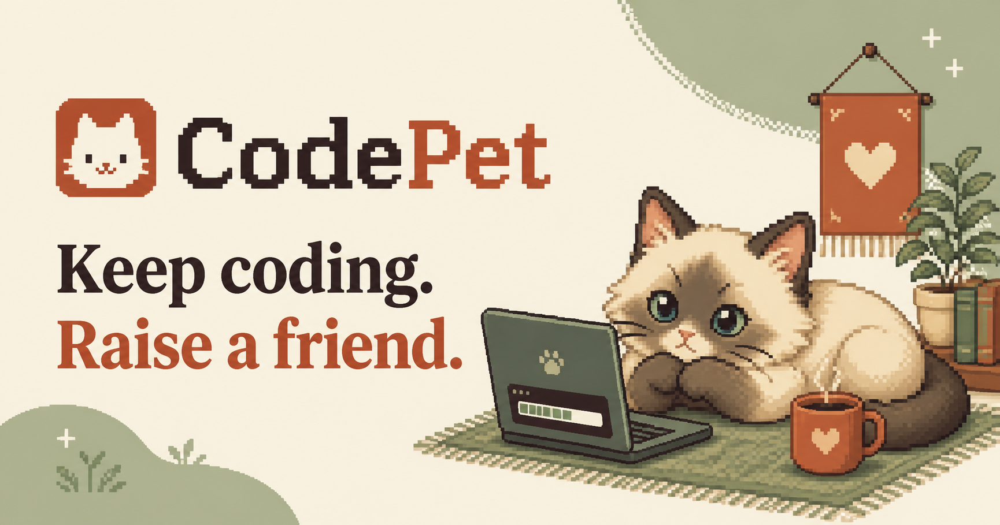

# CodePet

<p align="center">
  <strong>Keep coding. Raise a friend.</strong>
</p>

<p align="center">
  A tiny pixel-art companion that lives on your desktop, reacts to your care,
  and grows with your GitHub activity.
</p>

<p align="center">
  <a href="https://github.com/Cyn30/codepet/actions/workflows/ci.yml"></a>
  
  
  
  <a href="LICENSE"></a>
  <a href="https://github.com/Cyn30/codepet/stargazers"></a>
</p>

<p align="center">
  
</p>

<p align="center">
  <a href="https://github.com/Cyn30/codepet/releases"><strong>Download CodePet</strong></a>
  ·
  <a href="README.zh-CN.md">Chinese README</a>
  ·
  <a href="https://github.com/Cyn30/codepet/issues/new">Report a bug</a>
  ·
  <a href="CONTRIBUTING.md">Contribute</a>
</p>

> **Public alpha:** the desktop pet, natural behavior system, two-pet household,
> shop, GitHub rewards, save migration, and cross-platform build pipeline are
> implemented. Installers should still be tested on real devices before each
> release. If no packaged release is listed yet, use the source installation below.

## Why CodePet?

CodePet turns consistent coding into a small relationship you can see. Your pet
rests, walks, runs, eats, asks for attention, and shows its mood in an emoji bubble.
Commits, pull requests, and new repositories become XP, coins, bond points, and
occasional food drops.

It uses a normal native desktop window—the same broad application pattern used by
interactive companions, while its artwork, game rules, and code are
original. It does **not** monitor your keyboard and does **not** read your source code.

## Highlights

| | Feature | What it means |
| --- | --- | --- |
| 🐾 | Native desktop pet | Transparent, frameless, draggable, always-on-top pet windows |
| 🎞️ | Natural pixel animation | Idle, walk, run, eat, affection, and sleep clips for every breed |
| 🌿 | Believable behavior | Gradual acceleration, braking, rests, digestion time, and no teleporting |
| 💻 | GitHub-powered growth | Commits, pull requests, and new repositories generate rewards |
| 💛 | Care and bond | Hunger, happiness, energy, five bond ranks, moods, food, and play |
| 🐱 | Cats and dogs | Six breeds, with up to two pets in one household |
| 🏠 | Cage and free-roam modes | Let pets explore, rest, run briefly, or return home |
| 🔒 | Local-first privacy | Local saves, OS keychain credentials, no telemetry, no keyboard tracking |

## Install

Prebuilt releases include Python, Qt, and the artwork, so regular users do not need
to install development tools.

### macOS

1. Open the [Releases page](https://github.com/Cyn30/codepet/releases).
2. Download `CodePet-macOS.dmg` from the newest release.
3. Open the disk image and drag `CodePet.app` into **Applications**.
4. Open CodePet from Applications.

Alpha builds may not yet be notarized. If macOS blocks one, right-click CodePet in
Applications, select **Open**, and confirm only if you downloaded it from this
repository. Stable public releases should use Apple Developer ID signing and
notarization.

### Windows

1. Download `CodePet-Windows.zip` from the [Releases page](https://github.com/Cyn30/codepet/releases).
2. Extract the entire archive.
3. Open the extracted `CodePet` directory.
4. Run `CodePet.exe`.

Keep the whole directory together; the adjacent Qt libraries are required.

### Linux

1. Download `CodePet-Linux.tar.gz` from the [Releases page](https://github.com/Cyn30/codepet/releases).
2. Extract the archive.
3. Run `CodePet/CodePet`.

X11 currently provides the most consistent transparent, always-on-top behavior.
Wayland behavior depends on the compositor.

## Your first three minutes

1. Choose a name, species, and breed.
2. Set a lifespan from 14 to 3,650 days.
3. Select **Adopt**.
4. Click the desktop pet to pet it and gain 1–2 bond points.
5. Right-click it to rest, walk, run, resume natural behavior, return to the cage,
   sync GitHub, or hide the household.
6. Open **CodePet Home** to feed your pet, visit the shop, change the active pet,
   or adopt a second companion.

GitHub rewards go to the currently selected pet. Coins, food, and processed event
history belong to the household, so the same GitHub event cannot be rewarded twice.

## Natural behavior, not random poses

CodePet chooses bounded behavior phases instead of selecting a new random pose on
every timer tick. A cat may watch quietly, stroll, run for a short burst, slow down,
and curl up for a longer rest. Dogs favor longer walks; cats favor longer naps and
shorter bursts. Recent-state memory reduces repetitive loops, and every phase has a
maximum duration.

Movement uses elapsed real time rather than a fixed number of pixels per frame.
Walking is roughly 10–16 pixels per second and running is roughly 27–38, so a few
steps cannot carry a pet across the screen. Pets brake before screen edges, pause
before turning, finish an animation loop before changing clips, and rest after eating.

## Connect GitHub safely

The recommended connection method is built into the desktop app:

1. Open **CodePet Home**.
2. Select **Connect GitHub**.
3. CodePet copies a one-time code and opens GitHub in your browser.
4. Enter the code and approve the requested read-only access.
5. Return to CodePet and select **Sync GitHub**.

CodePet uses GitHub Device Flow. The resulting credential is stored in macOS
Keychain, Windows Credential Locker, or the Linux desktop keyring. It is never
written to `save.json`, the website, or this repository.

### What CodePet requests

| Data | Used for |
| --- | --- |
| GitHub user ID and username | Identify the authorized owner |
| Commit IDs and authorship | Count the owner's recent commits |
| Pull request contribution IDs | Reward recent pull requests |
| Repository contribution IDs | Reward newly created repositories |

The GitHub App has read-only Metadata, Contents, and Pull requests permissions.
Although the Contents permission technically allows read access to repository data,
CodePet's GraphQL query does not request file contents, diffs, source code, commit
messages, issue text, or secrets. Private activity is available only when the user
and the GitHub App installation both have access.

### Developer alternatives

You can also authenticate with [GitHub CLI](https://cli.github.com/):

```bash
gh auth login
```

Or start CodePet with a fine-grained, read-only development token:

```bash
export GITHUB_TOKEN="github_pat_your_token_here"
codepet-desktop
```

On PowerShell:

```powershell
$env:GITHUB_TOKEN="github_pat_your_token_here"
codepet-desktop
```

Choose only the repositories you want counted and grant only Metadata, Contents,
and Pull requests read access. Never paste a real token into source code, Issues,
screenshots, commits, or documentation.

## The reward loop

Rewards are deterministic: the same GitHub event ID always produces the same result.
Processed IDs are stored locally, preventing duplicate rewards after repeated syncs.

| GitHub activity | XP | Coins | Bond | Food |
| --- | ---: | ---: | ---: | --- |
| Commit | 8–15 | 5–10 | 1–5 | 20% chance |
| Pull request | 12–20 | 5–10 | 2–5 | — |
| New repository | 5–8 | 1–3 | 1–2 | — |

Every level requires more XP than the previous one. Bond progresses through **New
Friends**, **Familiar**, **Friends**, **Best Friends**, and **Soulmates**.

<details>
<summary><strong>Food prices and preferences</strong></summary>

| Food | Price | Cat bond | Dog bond |
| --- | ---: | ---: | ---: |
| Cat Food | 15 | +3 to +5 | −2 to 0 |
| Dog Food | 15 | −2 to 0 | +3 to +5 |
| Chew Bone | 25 | −3 to 0 | +5 to +7 |
| Cooked Chicken | 35 | +4 to +7 | +4 to +7 |
| Salmon | 45 | +7 to +10 | +3 to +6 |
| Tuna | 60 | +9 to +13 | +1 to +4 |
| Celebration Feast | 100 | +10 to +14 | +10 to +14 |

Species-specific food is cheaper but can reduce bond when given to the wrong pet.
Higher-priced universal food is safer for both cats and dogs.

</details>

## Mood, care, and lifespan

- `😊` / `🥰` — happy and well cared for
- `😴` — low energy
- `😟` — hungry or unhappy
- `😿` / `🥺` — urgent care threshold
- `💤`, `🏠`, `🌿`, `✨` — rest, home, free-roam, and activity feedback

Offline decay is calculated in capped six-hour periods, so returning after a long
break cannot cause unlimited penalties. A neglected pet may lose a limited amount
of bond, but save data is never deleted. When its configured lifespan ends, the pet
becomes a **Cherished Memory** rather than disappearing.

## Privacy by design

- No global keyboard monitoring
- No source-code or commit-message collection
- No telemetry or advertising SDK
- No server operated by CodePet
- GitHub access is read-only
- Credentials stay in the operating-system keychain
- Pet data stays in `~/.codepet/save.json`
- Mouse events are received only when you interact with CodePet windows

The local save contains pet state, inventory, coins, timestamps, and processed event
IDs. It does not contain GitHub tokens, passwords, repository files, or source code.

## Run from source

Requires Python 3.10 or later:

```bash
git clone https://github.com/Cyn30/codepet.git
cd codepet
python3 -m venv .venv
source .venv/bin/activate
python -m pip install -e ".[desktop]"
codepet-desktop
```

On Windows, activate the environment with:

```powershell
.venv\Scripts\activate
```

## Development

```bash
python -m pip install -e ".[desktop,dev]"
python -m unittest discover -s tests -v
ruff check src tests scripts packaging/entrypoint.py
```

Validate every production animation atlas:

```bash
for atlas in assets/animations/*.png; do
  python scripts/validate_animation_atlas.py "$atlas"
done
```

Build an installer on the current operating system:

```bash
python -m pip install -e ".[desktop,packaging]"
python scripts/build_desktop.py
```

PyInstaller does not cross-compile. The release workflow builds on macOS, Windows,
and Linux separately and attaches the resulting installers to a versioned release.

<details>
<summary><strong>Project architecture</strong></summary>

```text
src/codepet/domain.py      pet, household, mood, bond, lifespan, and decay
src/codepet/catalog.py     food prices and species preferences
src/codepet/rewards.py     deterministic GitHub reward mapping
src/codepet/auth.py        Device Flow and OS credential storage
src/codepet/github.py      read-only GitHub GraphQL client
src/codepet/storage.py     atomic local persistence and save migration
src/codepet/animation.py   animation clips and state machine
src/codepet/sprites.py     validated breed-atlas loader
src/codepet/overlay.py     transparent desktop pet windows
src/codepet/dashboard.py   adoption, inventory, pet care, and shop UI
src/codepet/desktop.py     application controller and tray integration
packaging/                 frozen application entry point and specification
scripts/                   artwork validation and release build tools
tests/                     domain, rewards, auth, GitHub, and animation tests
```

The UI calls domain operations but does not calculate prices, rewards, or food
preferences. New clients and features should reuse the existing rules instead of
creating parallel implementations.

</details>

## Roadmap

- [ ] Signed and notarized macOS releases
- [ ] More breeds and additional pet species
- [ ] More cage, furniture, and room customization
- [ ] Achievements and richer coding streak feedback
- [ ] Improved pagination for very large GitHub accounts
- [ ] Broader Windows, Linux, and Wayland compatibility testing

Roadmap items are plans, not guarantees. Contributions and focused issue reports are
welcome.

## Contributing

Read [CONTRIBUTING.md](CONTRIBUTING.md) before opening a pull request. Game-rule
changes require tests. New artwork must be original and redistribution-compatible;
do not trace or copy sprites, palettes, silhouettes, or character designs from other
games.

If CodePet makes coding a little more fun, consider giving the repository a ⭐. It
helps new contributors and desktop-pet fans discover the project.

## License

Code is released under the [MIT License](LICENSE). Artwork licensing and attribution
are documented in [ASSET-LICENSE.md](ASSET-LICENSE.md).
